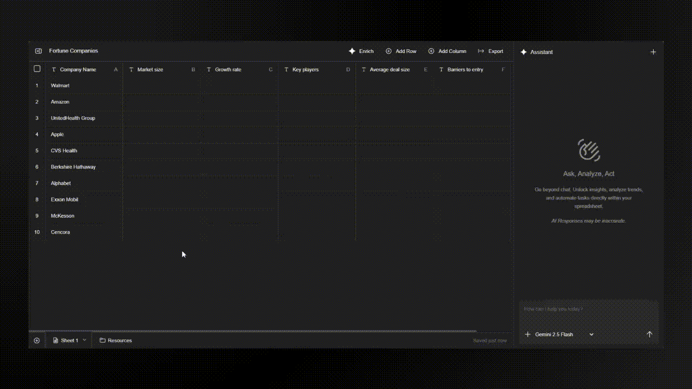
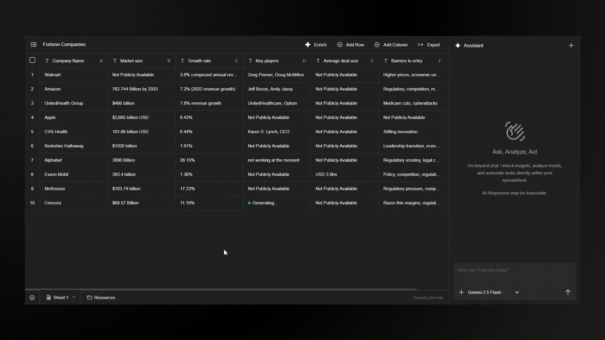
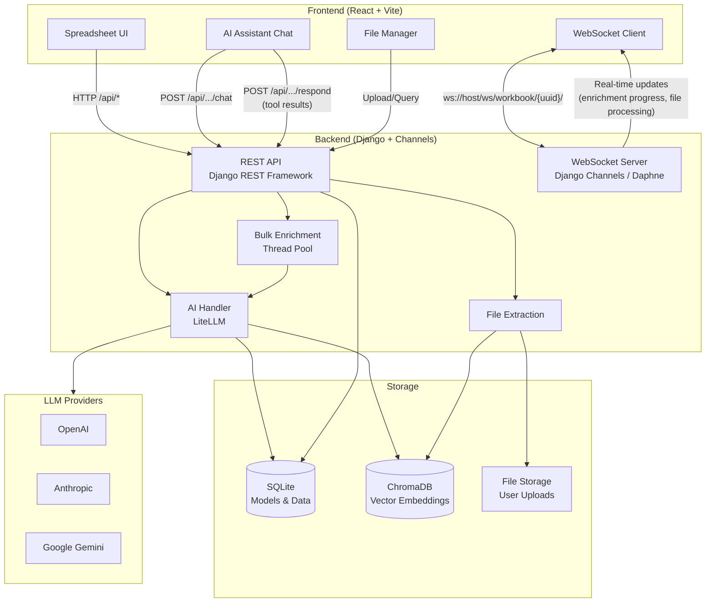

# DataFactory

> AI-powered spreadsheets with agents in every cell

[](LICENSE)
[](https://github.com/triumphal-io/datafactory/actions)
[](CONTRIBUTING.md)
[](https://github.com/triumphal-io/datafactory/stargazers)
[](https://github.com/triumphal-io/datafactory/discussions)

DataFactory is an AI-powered spreadsheet platform that combines the flexibility of traditional spreadsheets with advanced AI capabilities for data enrichment, analysis, and knowledge extraction.

Built on Django and React, it enables users to work with tabular data alongside uploaded documents (CSV, XLSX, PDF, DOCX, PPTX, TXT, MD) in a unified workspace, leveraging large language models for intelligent automation.

The core idea is to create **workbooks** that contain:
- **Sheets**: Editable spreadsheet tabs for structured data manipulation
- **Resources**: A document library where you can upload and organize files for AI-powered querying
- **AI Assistant**: A conversational interface that can manipulate sheets, query documents, search the web, and enrich data using RAG (Retrieval-Augmented Generation)

Unlike traditional spreadsheets, DataFactory allows you to ask natural language questions about your uploaded documents, automatically populate spreadsheet cells using AI, link spreadsheet rows to relevant files, and perform bulk enrichment operations across thousands of rows—all while maintaining real-time updates through WebSockets.

## Product Demo

### Bulk Enrichment


Automatically enrich thousands of spreadsheet cells using AI. Select a column, define what data you want to populate, and DataFactory will use the context from your entire row to generate relevant information. The enrichment runs concurrently with real-time progress updates via WebSockets, allowing you to enrich large datasets efficiently.

### RAG-Powered Document Search


Upload documents (PDF, DOCX, PPTX, CSV, XLSX, TXT, MD) and query them using natural language. DataFactory extracts content, creates vector embeddings with ChromaDB, and uses semantic search to find relevant information. Link spreadsheet cells directly to source documents for full traceability.

### Source Validation


Validate and verify data by linking spreadsheet rows to uploaded source documents. The AI assistant can automatically identify relevant sources from your document library, populate file references in your spreadsheet, and ensure data integrity through document-backed evidence.

## Use Cases

### Market Research


Conduct comprehensive market research by gathering company information, analyzing competitors, and enriching business data at scale. Upload industry reports, financial documents, and market analysis files, then use AI to extract insights, populate company profiles, and validate findings against source documents. Perfect for investment research, competitive analysis, and business intelligence workflows.

### Resume Screening


Streamline recruitment by automating resume analysis and candidate screening. Upload candidate resumes (PDF, DOCX) and job descriptions, then use AI to extract skills, experience, and qualifications into a structured spreadsheet. Match candidates to job requirements, score applications, and link each assessment back to the original resume for verification. Ideal for HR teams processing high volumes of applications.

## Features

- **Spreadsheet Manipulation**: Create and edit sheets with AI assistance
- **Enrich Data**: Bulk enrich thousands of cells individually using AI
- **File Processing**: Upload and extract content from CSV, XLSX, PDF, DOCX, PPTX, TXT, MD
- **RAG-based Querying**: Query uploaded documents using semantic search
- **Web Search & Scraping**: AI can search the web and scrape content
- **Real-time Updates**: WebSocket support for live updates
- **Multi-provider AI**: Configure OpenAI, Anthropic, or Google models per workbook
- **MCP Integration**: Connect external AI tool servers

## Tech Stack

- **Backend**: [Django](https://github.com/django/django), Django REST Framework, [Django Channels](https://github.com/django/channels) (WebSockets), Playwright (web scraping)
- **Frontend**: [React](https://github.com/facebook/react), [Vite](https://github.com/vitejs/vite)
- **AI**: [LiteLLM](https://github.com/BerriAI/litellm) (multi-provider abstraction for OpenAI, Anthropic, Gemini)
- **Vector Search**: [ChromaDB](https://github.com/chroma-core/chroma) (embeddings and RAG)
- **Database**: SQLite (development), PostgreSQL (recommended for production)
- **Libraries**: [Pandas](https://github.com/pandas-dev/pandas), [python-docx](https://github.com/python-openxml/python-docx), [python-pptx](https://github.com/scanny/python-pptx)

## Built With

[](https://www.djangoproject.com/)
[](https://reactjs.org/)
[](https://github.com/BerriAI/litellm)
[](https://www.trychroma.com/)
[](https://channels.readthedocs.io/)
[](https://vitejs.dev/)

## Architecture



> For a deeper dive into the data model, client-side tool execution pattern, and WebSocket architecture, see [docs/architecture.md](docs/architecture.md).

## Setup

### Backend Setup

1. Install Python dependencies:
```bash
cd backend
pip install -r requirements.txt
```

2. Install Playwright browsers (required for web scraping):
```bash
playwright install chromium
```

3. Set up environment variables:
```bash
cp .env.example .env
# Edit .env with your API keys (at minimum one LLM provider key)
```

4. Run migrations:
```bash
python manage.py migrate
```

5. Start the backend server:
```bash
python manage.py runserver 0.0.0.0:50
```

### Frontend Setup

1. Install Node dependencies:
```bash
cd frontend
npm install
```

2. Start the development server:
```bash
npm run dev
```

The frontend runs on port 5173 and proxies `/api` requests to the backend on port 50.

## Contributing

We welcome contributions! Please see [CONTRIBUTING.md](CONTRIBUTING.md) for guidelines on how to get started, branch naming conventions, commit message format, and the PR process.

## Star History

[](https://star-history.com/#triumphal-io/datafactory&Date)

## Contributors

Thanks to all contributors who have helped make DataFactory better!

[](https://github.com/triumphal-io/datafactory/graphs/contributors)

## License

DataFactory is licensed under the [GNU Affero General Public License v3.0](LICENSE). See the [LICENSE](LICENSE) file for details.
