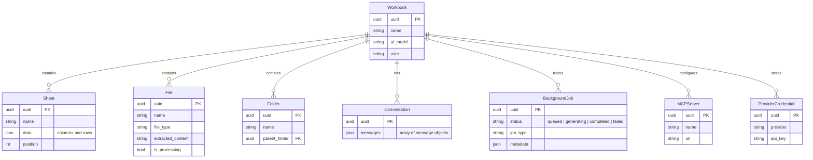
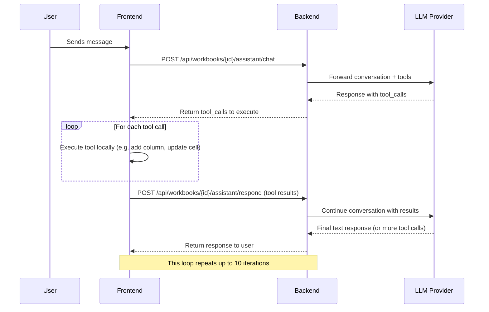
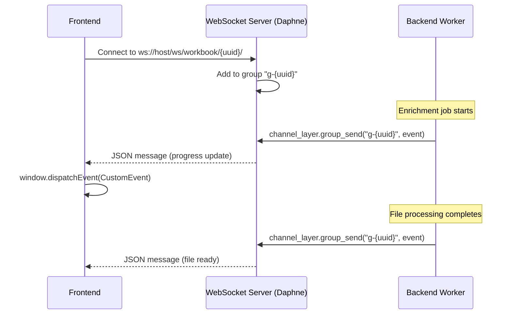
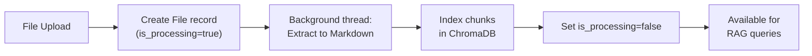
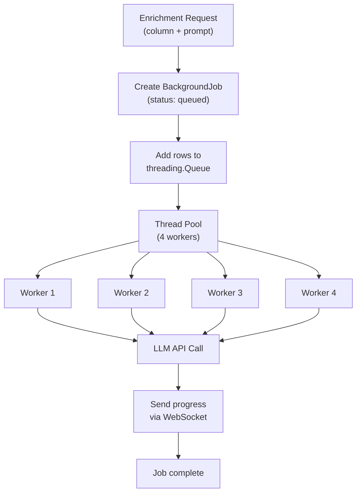

# Architecture

DataFactory is an AI-powered spreadsheet platform built with a Django backend and React frontend, connected via REST APIs and WebSockets for real-time updates.

## Data Model

All models use **UUID primary keys** (not auto-incrementing integers).



### Sheet Data Structure

Sheet data is stored as a `JSONField` with this shape:

```json
{
  "columns": [
    { "id": "col-uuid", "name": "Company", "type": "text", "width": 200 },
    { "id": "col-uuid", "name": "Revenue", "type": "number", "width": 120 }
  ],
  "rows": [
    { "id": "row-uuid", "cells": { "col-uuid": { "value": "Acme Inc" }, ... } }
  ]
}
```

### Key Terminology

- **Sheets** = editable spreadsheet tabs in a workbook (grid data). Sheet tools manipulate grid columns, rows, and cells.
- **Resources/Files** = uploaded documents in the file library. File tools query document content via RAG.
- These are **not** the same thing and use different API endpoints and AI tools.

## Client-Side Tool Execution

The AI assistant uses a **round-trip pattern** where the frontend acts as the execution engine for tool calls. This design allows spreadsheet operations to happen client-side (where the grid state lives) while keeping the LLM conversation on the backend.



### Why Client-Side Execution?

1. **State locality**: The spreadsheet grid state lives in the React frontend. Executing tools client-side avoids syncing issues.
2. **Immediate UI feedback**: Users see changes as they happen, without waiting for a server round-trip for each operation.
3. **Reduced backend complexity**: The backend doesn't need to maintain a copy of the live grid state.

### Conversation Limits

| Limit | Value |
|-------|-------|
| Max messages per conversation | 30 |
| Max tool iterations per turn | 10 |
| Max tools per single LLM response | 15 |
| Max tokens per LLM response | 2048 |

## WebSocket Pattern

WebSockets provide real-time updates for long-running operations like bulk enrichment and file processing.



### Connection Details

| Aspect | Detail |
|--------|--------|
| URL pattern | `ws://localhost:50/ws/workbook/{uuid}/` |
| Group naming | `g-{workbook_uuid}` |
| Server | Daphne (ASGI) via Django Channels |
| Frontend dispatch | `window.dispatchEvent(new CustomEvent('websocket-message', ...))` |
| Connection management | Singleton map prevents duplicate connections per workbook |

### Events Sent Over WebSocket

- **Enrichment progress**: Row-by-row status updates during bulk enrichment jobs
- **File processing**: Notifications when uploaded files finish extraction and indexing
- **Background job status**: Status transitions (queued, generating, completed, failed)

## File Processing Pipeline



Supported formats: CSV, XLSX, PDF, DOCX, PPTX, TXT, MD.

## Bulk Enrichment

Bulk enrichment processes many cells in parallel using a thread pool:



Each worker picks a row from the queue, calls the LLM with the enrichment prompt, writes the result to the cell, and sends a WebSocket update. The `BackgroundJob` status transitions: **queued** → **generating** → **completed** (or **failed**).
